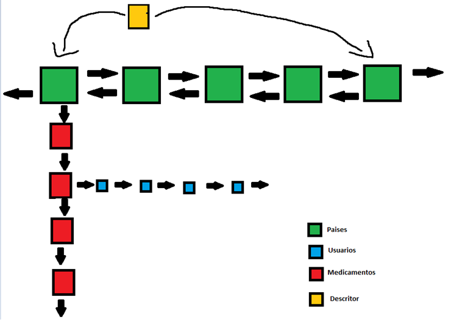

## Health Record Keeper in C

### Overview

Data-Structure-Register-C is a project focused on implementing a robust data structure for managing medical information. It features a Double Linked List Ordered by Countries, where each country node points to a Simply Linked List of Medicines. Additionally, each medicine node in the list points to a Simply Linked List of Users who use that medication. This design ensures efficient organization and retrieval of medical data.

### Features

- Double Linked List Ordered by Countries
- Simply Linked List of Medicines
- Simply Linked List of Users for each Medicine
- Purchase history tracking for Users

### Note

In this database, Countries and Medicines are not repeated, ensuring efficient data management. However, users may be repeated to maintain the purchase history of each medication.

### Feedback

Feedback is essential for improving this project. If you have any suggestions, questions, or comments, please feel free to reach out. Your input is highly appreciated!

### Contact

For feedback or inquiries, please contact: gcgonzalez99@hotmail.com
